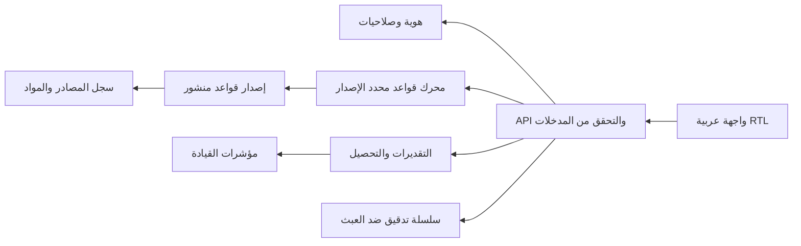

# معمارية نظام حساب الرسوم القضائية

## 1. حدود المنتج

المنصة تفصل ثلاثة مفاهيم لا يجوز دمجها محاسبيًا:

1. **التقدير**: ناتج آلي قابل للمراجعة قبل التحصيل.
2. **المطالبة المعتمدة**: ناتج التقدير بعد مراجعة الموظف واعتماد الصلاحية المختصة.
3. **التحصيل الفعلي**: حدث مالي وارد من نظام الدفع/الخزانة ولا يُستنتج من التقدير.

لذلك لا تجمع لوحة القيادة المبالغ المقدرة باعتبارها إيرادًا. مؤشرات الإيراد مبنية على `collection_events`، وعدد المحاكم يعني المحاكم التي أرسلت حركة في الفترة، لا إجمالي المحاكم على مستوى الجمهورية.

## 2. المكوّنات

النموذج الحالي يستخدم React وFastify وSQLite. مسار الإنتاج المقترح: React ثابت خلف WAF/Reverse Proxy، Fastify بلا حالة، PostgreSQL عالي الإتاحة، مخزن كائنات للمستندات، وموفر هوية حكومي OIDC.

## 3. دورة حياة قاعدة قانونية

`مقترح مقيد النطاق → مراجعة قانونية مستقلة → اعتماد/رفض → نشر من صاحب النطاق → إيقاف/استبدال`

- لا تُعدّل قاعدة منشورة في مكانها.
- التقدير يحفظ `ruleSetId` و`ruleSetVersion` ونسخة النتيجة؛ إعادة الحساب لاحقًا لا تغيّر الماضي.
- تاريخ السريان القانوني منفصل عن وقت إدخال القاعدة للنظام (bitemporal design في الإنتاج).
- صاحب المسودة لا يعتمدها. يجب تسجيل هوية الطرفين في أثر التدقيق.
- القاعدة لا تُنشر دون مصدر ومادة وحالات اختبار حدية وقرار مراجعة.
- رئيس القلم لا يقترح أو ينشر إلا داخل `court_id` المرتبط به، ولا يستطيع اختيار محكمة أخرى من الواجهة أو من API.
- التعديل العام `global` لا يقترحه ولا ينشره إلا الحساب الذي يطابق `JUDICIAL_FEES_PROJECT_MANAGER_ID`، وهو معرف وحيد مطلوب في الإنتاج.
- اعتماد المراجع القانوني لا ينشر القاعدة تلقائيًا؛ النشر قرار تالٍ منفصل ومسجل، ولا توجد واجهة لتعديل القاعدة المنشورة مباشرة.
- عند الحساب يحل الخادم القواعد المنشورة السارية زمنيًا؛ تتقدم قاعدة المحكمة على القاعدة العامة لنفس `rule_code`، ولا تؤثر في محكمة أخرى أو في تقدير محفوظ سابقًا.
- تخزن القيم كمعاملات صحيحة محددة البنية، ويولد النظام الوصف المقروء منها. لا يُنفذ نص المعادلة المعروض ولا أي كود يكتبه المستخدم.

## 3.1 نوع الدعوى قبل المعادلة

لا يختار المحرك جدول الرسوم من «معلوم/مجهول القيمة» وحده. يبدأ من ملف قانوني لنوع الدعوى يحدد:

- الولاية القضائية، العائلة القانونية، ودرجات المحكمة الممكنة.
- قالب تقدير القيمة: قيمة طلب مباشر، أجرة × مدة، قيمة حكم، عدد وحدات/صفحات، أو مراجعة قانونية لازمة.
- الوقائع الإلزامية قبل الحساب، ومصادر قاعدة التقييم.
- حالة التغطية: `calculable` أو `conditional` أو `blocked`.

تُرفض الأنواع المجهولة، والدرجة غير المتوافقة، وطبيعة القيمة المخالفة، والوقائع الناقصة. الأنواع المحجوبة لا تسقط إلى معادلة عامة.

## 4. نموذج القاعدة

كل قاعدة تحتاج الحقول الآتية:

| الحقل | الغرض |
|---|---|
| `code` | معرف ثابت مثل `ORIGINAL_RELATIVE` |
| `scope` | درجة المحكمة، المرحلة، نوع الطلب، معلوم/مجهول القيمة |
| `parameters` | الشرائح والنسب والحدود والقيم الثابتة |
| `basis` | قيمة الدعوى/المقضي به/عدد الصفحات/الطلبات… |
| `rounding` | موضع الجبر ووحدته، لا تقريب ضمني |
| `effectiveFrom/To` | فترة السريان القانونية |
| `sourceId/article/page` | السند القانوني الدقيق |
| `status` | مسودة/منشورة/محجوبة |
| `tests` | أمثلة حدودية مع نتيجة معتمدة |

تُحظر التعبيرات البرمجية الحرة التي يدخلها المستخدم. التعديل يتم عبر قوالب قواعد typed templates ومعاملات رقمية مقيدة، لتجنب تنفيذ كود أو معادلات غير آمنة.

## 5. الدقة المالية

- التخزين الداخلي بالمليم (`INTEGER`)، وليس `float`.
- الجبر يطبق في الموضع المنصوص عليه ويظهر في الشرح.
- كل بند يُحسب منفردًا ثم يجمع؛ لا توجد «قيمة إجمالية» بلا تفصيل.
- الإدخالات السالبة و`NaN` والقيم فوق الحد التشغيلي ترفض في API.
- يعاد المحرك بنتيجة حتمية لنفس المدخلات وإصدار القواعد.

## 6. رحلة الموظف

1. اختيار المحكمة والدرجة ومرحلة الحساب.
2. البحث في نوع الدعوى المستورد من المصنف؛ التصنيف المبدئي لا يغني عن التحقق.
3. اختيار معلوم/مجهول القيمة وإدخال وعاء الرسم.
4. إظهار الإجمالي مع البنود والمصدر والتحذيرات.
5. حفظه كمسودة؛ المراجعة ثم الإصدار خطوة منفصلة.
6. في نهاية الدعوى يدخل المقضي به والسابق سداده، ويصدر بند التسوية فقط.

## 7. لوحة القيادة

المؤشرات الأساسية:

- المستحق للتحصيل من المطالبات المعتمدة.
- المتحصل الفعلي من أحداث الدفع.
- القائم = المستحق − المتحصل.
- معدل التحصيل = المتحصل ÷ المستحق.
- عدد المحاكم المرسلة، واتجاه شهري، ومقارنة المحاكم.

يجب أن تحمل كل لوحة `asOf` وحالة جودة (`live/demo/delayed`) ومصدر البيانات. أرقام النموذج الحالي معلّمة صراحة «تجريبية».

## 8. التكامل والإنتاج

- هوية OIDC مع MFA للأدوار الحساسة.
- معرف قضية/طلب قادم من نظام إدارة الدعاوى، لا إدخال حر في الإنتاج.
- Webhooks أو صف رسائل لأحداث التحصيل مع `idempotency_key`.
- PostgreSQL مع Row Level Security بحسب المحكمة، ونسخ احتياطي واختبار استعادة.
- تخزين المستندات ببصمة SHA‑256 وتوقيع زمني، وفحص برمجيات خبيثة عند الرفع.
- مراقبة: latency، أخطاء القواعد، نسب الإلغاء اليدوي، فجوات التكامل، وسلامة سلسلة التدقيق.
